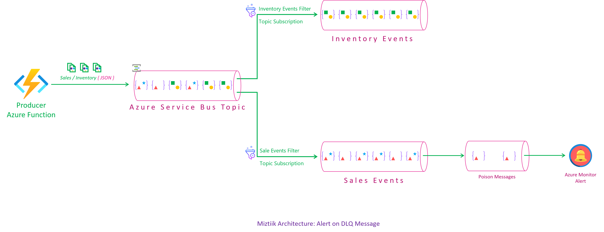

# Alert on DLQ Messages in Azure Service Bus

Mystique Enterprises want to alert on the messages that are landing in the DLQ of the Azure Service Bus. They want monitor the DLQ and send alerts to the operations team. In this article, we will build a solution to monitor the DLQ and send alerts to the operations team.


## 🎯 Solution

The _very_ high level overview of Azure Kubernetes Service looks like this,



1. ## 🧰 Prerequisites

   This demo, along with its instructions, scripts, and Bicep template, has been specifically designed to be executed in the `northeurope` region. However, with minimal modifications, you can also try running it in other regions of your choice (the specific steps for doing so are not covered in this context)

   - 🛠 Azure CLI Installed & Configured - [Get help here](https://learn.microsoft.com/en-us/cli/azure/install-azure-cli)
   - 🛠 Azure Function Core Tools - [Get help here](https://learn.microsoft.com/en-us/azure/azure-functions/functions-run-local?tabs=v4%2Cwindows%2Ccsharp%2Cportal%2Cbash#install-the-azure-functions-core-tools)
   - 🛠 Bicep Installed & Configured - [Get help here](https://learn.microsoft.com/en-us/azure/azure-resource-manager/bicep/install)
     - 🛠 [Optional] VS Code & Bicep Extenstions - [Get help here](https://learn.microsoft.com/en-us/azure/azure-resource-manager/bicep/install#vs-code-and-bicep-extension)
   - `jq` - [Get help here](https://stedolan.github.io/jq/download/)
   - `bash` or git bash - [Get help here](https://git-scm.com/downloads)

2. ## ⚙️ Setting up the environment

   - Get the application code

     ```bash
     git clone https://github.com/miztiik/azure-topic-filter-dlq-alert.git
     cd azure-topic-filter-dlq-alert
     ```

3. ## 🚀 Prepare the local environment

   Ensure you have jq, Azure Cli and bicep working

   ```bash
   jq --version
   func --version
   bicep --version
   bash --version
   az account show
   ```

4. ## 🚀 Deploying the Solution

   - **Stack: Main Bicep**


      ```bash
      # make all
      sh deployment_scripts/deploy.sh
      ```

      After successfully deploying the stack, Check the `Resource Groups/Deployments` section for the resources.

5. ## 🔬 Testing the solution

   1. **Send Few Messages to Topic**

      ```bash
      #!/bin/bash

      # Define the URL to be called
      url="https://dlq-alert-store-backend-us-fn-app-002.azurewebsites.net/store-events-producer-fn"

      # Define the number of times to make the curl call
      n=100

      # Use a for loop to make curl calls without waiting for response
      for ((i=1; i<=$n; i++)); do
         # Use the '&' at the end to run each curl command in the background
         curl -s -o /dev/null -w "Request $i completed\n" "$url" &
         echo "----------Request $i of $n sent----------"
      done

      echo "All requests sent"
      ```

     Check Azure Monitor Portal and email

6. ## 📒 Conclusion

    In conclusion, this blog helps you to get started with Azure kubernetes service.
  
7. ## 🧹 CleanUp

   If you want to destroy all the resources created by the stack, Execute the below command to delete the stack, or _you can delete the stack from console as well_

   - Resources created during [Deploying The Solution](#-deploying-the-solution)
   - _Any other custom resources, you have created for this demo_

   ```bash
   # Delete from resource group
   az group delete --name Miztiik_Enterprises_xxx --yes
   # Follow any on-screen prompt
   ```

   This is not an exhaustive list, please carry out other necessary steps as maybe applicable to your needs.

## 📌 Who is using this

This repository aims to show how to Bicep to new developers, Solution Architects & Ops Engineers in Azure.

### 💡 Help/Suggestions or 🐛 Bugs

Thank you for your interest in contributing to our project. Whether it is a bug report, new feature, correction, or additional documentation or solutions, we greatly value feedback and contributions from our community. [Start here](/issues)

### 👋 Buy me a coffee

[](https://ko-fi.com/Q5Q41QDGK) Buy me a [coffee ☕][900].

### 📚 References

1. [Azure Docs - Data Collection Basics of Azure Monitor Application Insights][2]
1. [Azure Docs - Push your first image to your Azure container registry using the Docker CLI][3]

[2]: https://learn.microsoft.com/en-us/azure/azure-monitor/app/opentelemetry-overview
[3]: https://learn.microsoft.com/en-us/azure/container-registry/container-registry-get-started-docker-cli?tabs=azure-cli

### 🏷️ Metadata


**Level**: 200

[100]: https://www.udemy.com/course/aws-cloud-security/?referralCode=B7F1B6C78B45ADAF77A9
[101]: https://www.udemy.com/course/aws-cloud-security-proactive-way/?referralCode=71DC542AD4481309A441
[102]: https://www.udemy.com/course/aws-cloud-development-kit-from-beginner-to-professional/?referralCode=E15D7FB64E417C547579
[103]: https://www.udemy.com/course/aws-cloudformation-basics?referralCode=93AD3B1530BC871093D6
[899]: https://www.udemy.com/user/n-kumar/
[900]: https://ko-fi.com/miztiik
[901]: https://ko-fi.com/Q5Q41QDGK